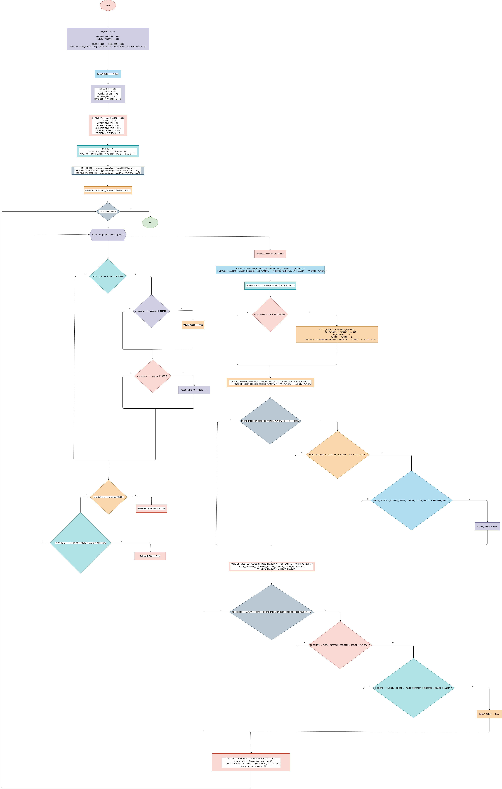

# bimestral_1

## Explicacion line a linea

import pygame: quiere decir que se importó una librería para desarrollar el juego.

from random import randint: permite generar números aleatorios.

pygame.init(): inicializa pygame para que funcione correctamente.

ANCHURA_VENTANA = 600: define el ancho de la ventana.

ALTURA_VENTANA = 600: define el alto de la ventana.

COLOR_FONDO = (255, 255, 250): establece un color de fondo (blanco).

PANTALLA = pygame.display.set_mode(...): crea la ventana del juego.

PARAR_JUEGO = False: indica que el juego está en ejecución.

XX_COHETE:coordenada x iniciales del cohete.

YY_COHETE:coordenada y inicial del cohete.

ALTURA_COHETE:Define el alto del cohete

ANCHURA_COHETE: Define el ancho del cohete

MOVIMIENTO_XX_COHETE = 0: variable para el movimiento horizontal.

XX_PLANETA = randint(30, 130): el planeta aparece en una posición aleatoria.

YY_PLANETA = 20: altura inicial del planeta.

VELOCIDAD_PLANETAS = 2: controla la velocidad de caída.

PUNTOS = 0: almacena la puntuación.

FUENTE = pygame.font.Font(None, 24): define el tamaño y tipo del texto puntos.

MARCADOR: crea el texto de la puntuación.

pygame.image.load( ): carga las imágenes del cohete y planetas.

pygame.display.set_caption( ): establece el título de la ventana.

while not PARAR_JUEGO:: mantiene el juego en ejecución.

## Diagrama de flujo

